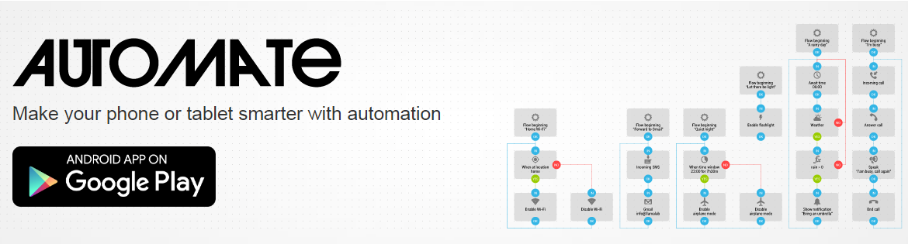

<link rel="stylesheet" href="github-markdown.css" />

# My Android Automate Workflows

This repository is a **backup storage** of my workflows for the android app **Automate**.

    The future trends to automation.

All them :100: :heavy_check_mark: **are working** on my Android mobile devices :metal:.
So, if you like :sparkling_heart: :thumbsup: some workflow, please :pray:,
support my project development:

- Put me an star :star2:
- Share the url in your social networks :smirk:

Made them with :heart: from :es: Spain to everybody.

:thought_balloon::grinning: Thanks for being and staying!

## Project Structure

Each Android application have their a specific folder with their own workflows.
These are all the workflows you have for:

-  [Whatsapp](./flows-whatsapp)
(Coming soon)
-  [Telegram](./flows-telegram)
(Coming soon)
-  [Twitter](./flows-twitter)
(Coming soon)
-   [YouTube](./flows-youtube)
(Coming soon)
-   [GitHub](./flows-github)
(Coming soon)

I also have in mind some useful integration ones between each others. E.g.

- Backup / Restore apps configuration to any cloud service.
- Detect my workflows that do the same action for each app, and execute it all together.

---

## But... what is **[Automate](https://llamalab.com/automate/)**?

|   |   |
|---|---|
|  | The free [Android™ application Automate]([https://link](https://play.google.com/store/apps/details?id=com.llamalab.automate)) lets you automate various tasks on your smartphone or tablet. Create your automations with flowscharts, make your device automatically change settings like Bluetooth, Wi-Fi, NFC or perform actions like sending SMS, e-mail, based on your location, the time of day, or any other “event trigger”. You can automate almost everything on your device, Automate even support plug-ins made for [Tasker]([https://link](https://play.google.com/store/apps/details?id=net.dinglisch.android.taskerm)) and [Locale]([https://link](https://play.google.com/store/apps/details?id=com.twofortyfouram.locale)).|
